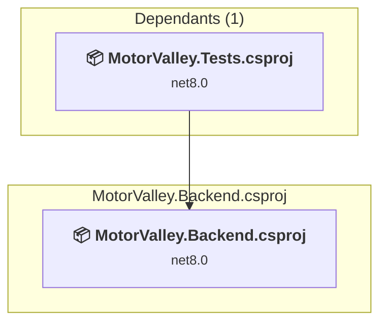

# MotorValley.Backend\MotorValley.Backend.csproj

[← Back to the assessment index](../../assessment.md)

## Project Info

- **Current Target Framework:** net8.0
- **Proposed Target Framework:** net10.0
- **SDK-style**: True
- **Project Kind:** AspNetCore
- **Dependencies**: 0
- **Dependants**: 1
- **Number of Files**: 26
- **Number of Files with Incidents**: 6
- **Lines of Code**: 986
- **Estimated LOC to modify**: 7+ (at least 0.7% of the project)

## Related Projects

**Depended on by (1)** — projects that reference this one:

- [c:\Users\krsit\Desktop\Motor-Valley-Sentinel-main\backend\MotorValley.Tests\MotorValley.Tests.csproj](../projects/MotorValley.Tests.md)

## Dependency Graph

Legend:
📦 SDK-style project
⚙️ Classic project

## API Compatibility

| Category | Count | Impact |
| :--- | :---: | :--- |
| 🔴 Binary Incompatible | 0 | High - Require code changes |
| 🟡 Source Incompatible | 7 | Medium - Needs re-compilation and potential conflicting API error fixing |
| 🔵 Behavioral change | 0 | Low - Behavioral changes that may require testing at runtime |
| ✅ Compatible | 1308 |  |
| ***Total APIs Analyzed*** | ***1315*** |  |

## NuGet Package Issues

| Package | Current Version | Suggested Version | Severity | Issue |
| :--- | :---: | :---: | :---: | :--- |
| Microsoft.Azure.SignalR | 1.28.0 | — | 🔵 Optional | NuGet package is deprecated |
| Microsoft.EntityFrameworkCore | 8.0.10 | 10.0.12 | 🟡 Potential | NuGet package upgrade is recommended |
| Microsoft.EntityFrameworkCore.Design | 8.0.10 | 10.0.12 | 🟡 Potential | NuGet package upgrade is recommended |
| Microsoft.EntityFrameworkCore.Sqlite | 8.0.10 | 10.0.12 | 🟡 Potential | NuGet package upgrade is recommended |

Every project affected by these packages, and the versions the repository settles on: [aggregate NuGet packages](../nuget/aggregate-packages.md).

