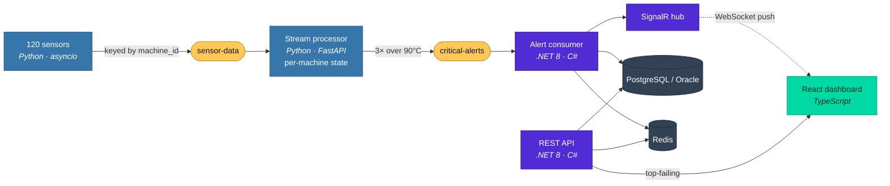

# Motor Valley Sentinel

[](https://github.com/kristikomini/Motor-Valley-Sentinel/actions/workflows/ci.yml)
[](https://dotnet.microsoft.com/)
[](LICENSE)

Real-time condition monitoring for a factory floor. 120 simulated machines stream
temperature and RPM into Kafka; a stateful stream processor watches each machine for a
sustained overheat and republishes a critical alert; a .NET service consumes those alerts,
persists them, and pushes them to a live dashboard over WebSockets.

The domain is the one on my doorstep — engine dynos and packaging lines, the machinery
that Emilia-Romagna actually builds.



<sub>Five services, five languages' worth of moving parts, one `docker compose up`. See
[Running it in the cloud](#running-it-in-the-cloud) for the Azure PaaS equivalent of this
topology.</sub>

---

## Why Kafka, and not an HTTP call

The producer could POST readings straight at the .NET API. Kafka earns its place here for
three reasons that only show up under load:

**Backpressure isolation.** At 120 machines on a 500 ms interval the floor emits ~240
readings/second, continuously, whether or not anything downstream is healthy. With HTTP,
a slow database write becomes a slow sensor. With a log in between, the producer's
latency is decoupled from the consumer's — the broker absorbs the difference and the
consumer drains at its own pace.

**Replay.** Both consumers use `auto.offset.reset=earliest`. Restart the processor and it
rebuilds from the retained log rather than from whatever happened to arrive next. A
crashed HTTP endpoint just loses the window it was down for.

**Two independent readers of one stream.** The processor consumes raw readings; the .NET
service consumes derived alerts. Neither knows the other exists. Adding a third
consumer — an archiver, a separate anomaly model — costs one consumer group and no change
to the producer.

## Design decisions worth defending

**Messages are keyed by `machine_id`.** This is the load-bearing choice in the whole
system. Kafka guarantees ordering within a partition, and keying sends every reading from
one machine to the same partition. Because the processor's "3 consecutive readings above
90 °C" rule is per-machine state, that guarantee is what lets the rule stay correct if the
processor is ever scaled out: partitions are distributed across group members, so a given
machine's entire history lands on exactly one instance. Round-robin partitioning would
scatter a machine's readings across instances and the consecutive-count logic would
silently produce wrong answers under scale-out. See the limitation on partition count
below — the property is designed for, not yet exercised.

**Alerting is stateful, not per-message.** A single reading over threshold is noise; a
thermocouple glitch should not page anyone. The processor holds a 5-reading window and a
consecutive-breach counter per machine, emits `CRITICAL_ALERT` only on the third
successive reading above 90 °C, and resets the counter the moment a normal reading
arrives. Threshold and window live in `processor/processor.py` as named constants.

**At-least-once alert delivery with idempotent writes.** The .NET consumer does not
auto-commit. It commits an offset only *after* the alert is durably in Postgres, and on a
transient failure it rewinds to the offset and retries rather than committing past it — so
a crash between the broker and the database can never silently drop an alert. Redelivery is
made safe by a unique index on `(machine_id, timestamp)`: the repository's insert is
idempotent, so a replayed message is a no-op rather than a duplicate row, and the dashboard
is not notified twice. That same unique key is what lets the top-failing query resolve each
machine's latest row in a single join instead of a query per machine.

**Cache-aside on the read path.** `GET /api/alerts/latest-status` checks Redis first and
falls back to Postgres on a miss, with a 5-minute TTL. The Kafka consumer also writes the
key as alerts land, so the hot path is usually warm rather than waiting to be filled by a
miss.

**Persistence is behind a provider-agnostic seam.** All data access goes through
`IAlertRepository` over EF Core, so the relational engine is a configuration choice, not a
code one. PostgreSQL is the default that ships and runs in Docker; Oracle is wired and
selected with `Database:Provider=Oracle` plus its connection string — no repository or
domain code changes. Schema is versioned with **EF Core migrations** (applied on startup),
not `EnsureCreated()`, so tables can evolve without being dropped.

**Push, not poll.** Alerts reach the browser over SignalR the moment the consumer commits
them. The client reconnects automatically and keeps the last 50 in view. Polling a
`/latest` endpoint would have been simpler and would have put 120 machines' worth of
staleness between an overheat and the operator seeing it.

---

## Running it

Requires Docker and Docker Compose. Nothing else — no local .NET, Python, or Node needed.

```bash
docker compose up --build
```

| Surface | URL |
|---|---|
| Dashboard | http://localhost:5173 |
| Backend API + Swagger | http://localhost:5000/swagger |
| Processor health / moving average | http://localhost:8000/health |

Host ports are deliberately offset from the defaults — Kafka on **9093**, Redis on
**6380** — so the stack does not collide with a broker or cache already running locally.
Topics (`sensor-data`, `critical-alerts`) are created by a one-shot `kafka-init` service,
and the backend waits on its completion rather than racing it.

### Watching it actually work

Machines drift by a random walk, so alerts build rather than appear instantly. To watch
the alert stream directly instead of through the dashboard:

```bash
docker compose exec kafka kafka-console-consumer --bootstrap-server kafka:9092 --topic critical-alerts --from-beginning
```

To confirm the processor is keeping per-machine state:

```bash
curl http://localhost:8000/moving-average/MACHINE-0001
```

## Running it in the cloud

The same five services deploy to **Azure** by swapping each self-hosted container for a
managed PaaS equivalent — Kafka → Event Hubs (Kafka endpoint), Postgres → Azure Database for
PostgreSQL, Redis → Azure Cache for Redis, in-process SignalR → Azure SignalR Service — with
the apps themselves running as **Azure Container Apps**. None of the application code changes;
the wiring is all connection strings. The topology is captured as Bicep infrastructure-as-code
and a manually-triggered deployment pipeline:

- [`deploy/azure/main.bicep`](deploy/azure/main.bicep) — the full stack as IaC
- [`deploy/azure/README.md`](deploy/azure/README.md) — the local→cloud mapping and deploy steps
- [`.github/workflows/cd.yml`](.github/workflows/cd.yml) — build images → push to ACR → deploy

## Tests

```bash
dotnet test backend/MotorValley.sln

# The tests import the processor/producer modules, so install their runtime deps too:
pip install -r processor/requirements.txt -r producer/requirements.txt -r tests/python/requirements.txt
pytest tests/python
```

Both suites also run in CI on every push — see [`.github/workflows/ci.yml`](.github/workflows/ci.yml)
(.NET build+test, pytest, frontend lint+build, and Bicep validation).

The Python suite covers the alerting rule where the logic actually lives — no alert below
threshold, an alert on the third consecutive breach, and the counter resetting after a
normal reading. The xUnit suite covers the repository against EF Core's in-memory
provider and the Redis cache round-trip.

## Known limitations

The things I would fix before this went anywhere near a real plant, and why they are the
way they are:

- **Both topics run a single partition.** `kafka-init` creates them with
  `--partitions 1`, which caps the consumer group at one useful member. The keying above
  is what *makes* scale-out safe, but this configuration does not yet demonstrate it.
  Raising the count and running two processor replicas is the natural next commit.
- **Processor state is in-process and not checkpointed.** Restarting the processor
  forgets every machine's consecutive count. Reasonable at a 3-reading window; not
  reasonable if the rule ever spans minutes.
- **CORS is `AllowAnyOrigin`** and `BackgroundServiceExceptionBehavior` is set to
  `Ignore`, which keeps the host alive when the consumer throws but also hides that it
  did. Both are demo-shaped, not production-shaped.

## Stack

| Layer | Technology |
|---|---|
| Ingest | Python 3, `asyncio`, `aiokafka` |
| Broker | Apache Kafka 7.5 (Confluent), Zookeeper |
| Stream processing | Python, FastAPI, `aiokafka` consumer + producer |
| API & alert consumer | .NET 8 (LTS), ASP.NET Core, `Confluent.Kafka` 2.6 |
| Persistence | PostgreSQL 16 (default) or Oracle, EF Core 8 — provider-swappable |
| Cloud / deployment | Azure Container Apps + PaaS, Bicep IaC (see `deploy/azure/`) |
| CI/CD | GitHub Actions — build & test on every push, gated deploy to Azure |
| Cache | Redis 7, StackExchange.Redis |
| Realtime transport | SignalR (WebSockets) |
| Dashboard | React 19, TypeScript, Vite, Recharts |
| Tests | xUnit, pytest |
| Orchestration | Docker Compose |
